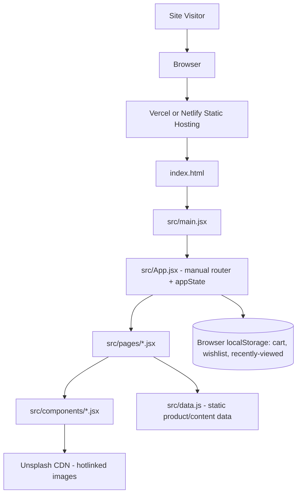

# System Architecture

> **Current implementation correction — 2026-07-24:** The authoritative architecture is Next.js App Router (`app/`), React 19 client storefront (`src/App.tsx`), Tailwind, static catalogue data (`src/data.ts`), and one Node.js route handler (`app/api/r2-presign/route.ts`). Supabase, Sanity, Vite, `src/pages`, `src/main.tsx`, and `api/r2-presign.ts` are removed. The R2 route uses server-only credentials, trusted-caller authentication, strict upload metadata validation, and process-local fallback rate limiting. Treat pre-correction detail below as historical only; `Memory.md` and `docs/security/` are current.

> **v2.0 update notice (see date in Memory.md once created):** the stack described in this document as "current" below reflects the **original plain-JS/CSS build**. As of the v2 rewrite, the project has moved to **TypeScript + Tailwind CSS**, with **Supabase, Sanity, and Cloudflare R2 client code scaffolded but not yet wired to any page** (no live data flows through them yet — the catalogue still runs off `src/data.ts`). §3 (Technology Stack) below has been updated to reflect this; other sections (backend architecture, database, API design, etc.) still describe the pre-v2 state and should be treated as historical/Not Applicable until those integrations are actually wired up in a future phase. Do not assume Supabase/Sanity/R2 are live — check `src/lib/*` and `api/r2-presign.ts` for the actual (unwired) client code, and confirm with the user before treating any backend section as current.

## 1. Architecture Overview

- **Architecture style (Verified):** Single-page application (SPA) — client-only React app with no server component. Routing is hand-rolled (no router library) using `window.location.pathname` string matching in `src/App.jsx`.
- **Main application layers (Verified):** `App.jsx` (routing + global state) → `pages/*.jsx` (route-level views) → `components/*.jsx` (presentational units) → `data.js` (static content/data source).
- **High-level system flow (Verified):** Browser loads `index.html` → `src/main.jsx` mounts `<App />` into `#root` → `App.jsx` reads `window.location.pathname`, matches it against a manual route table, and renders the matching page component, passing down a shared `appState` object (cart, wishlist, recently viewed, search) built with `useState`/`useMemo`.
- **Key architectural decisions (Verified, as found — not recommendations):**
  1. No router library (e.g., React Router) — routing is a chain of `if` statements returning JSX.
  2. No global state library (e.g., Redux/Zustand/Context) — state lives in `App.jsx` and is threaded through props as a single `appState` object.
  3. No backend — all "data" is a static JS module (`src/data.js`).
  4. Persistence is `localStorage` only, wrapped in try/catch helpers (`readStored`/`storeValue`).
  5. Styling is a single hand-written global CSS file (`src/styles.css`, 753 lines) using CSS custom properties — no CSS-in-JS, no Tailwind, no CSS modules.

## 2. Current Repository Assessment

- **Existing application type (Verified):** Client-side rendered React SPA built with Vite, deployed as static files.
- **Existing framework (Verified):** React (version unpinned — `"latest"` in `package.json`, resolves to React 19 at install time), Vite build tool, `@vitejs/plugin-react`.
- **Existing modules (Verified — reachable via routing in `App.jsx`):** Home, Shop/category listing, Product detail, Cart, Checkout (UI only), Wishlist (via Shop with custom data), Simple/static pages (Account, Order Tracking, Store Locator, Book Appointment, About, Blog, Contact, FAQ, Privacy, Terms, Returns), Not Found.
- **Working features (Verified):** Product browsing, filtering, sorting, search, cart quantity management, wishlist toggling, recently-viewed tracking, responsive mobile navigation menu, scroll-reveal animation (`Reveal.jsx`, IntersectionObserver-based).
- **Incomplete features (Verified):** Checkout form does not submit or persist anything; account/order-tracking/store-locator/appointment/contact pages are static text with no interactivity; header search performs a full page reload rather than a client-side transition.
- **Legacy or risky areas (Verified — critical finding):** The following files exist in the repository but are **never imported by `App.jsx`** and are therefore **unreachable dead code**, left over from the project's origin as a photography-portfolio Framer clone (per `README.md` and the repo name `motion-photography-react-clone`):
  - Pages: `src/pages/AboutPage.jsx`, `src/pages/ContactPage.jsx`, `src/pages/JournalPage.jsx`, `src/pages/PortfolioPage.jsx`, `src/pages/ProjectPage.jsx`
  - Components used only by the above: `src/components/AboutStudio.jsx`, `src/components/Hero.jsx`, `src/components/JournalStrip.jsx`, `src/components/Moments.jsx`, `src/components/SelectedWork.jsx`, `src/components/Services.jsx`, `src/components/Testimonials.jsx`, `src/components/FAQ.jsx`, `src/components/PageHero.jsx`, `src/components/SectionHeading.jsx`
  - `src/components/ArrowIcon.jsx` and `src/components/ButtonLink.jsx` are shared: `ArrowIcon` is used only by dead code; `ButtonLink` is used by dead code **and** by the live `NotFoundPage.jsx` — so `ButtonLink` must be kept.
  - `src/data.js` exports `projects` (a map derived from `products`) and `journalPosts` (alias of `blogPosts`) that exist solely to support this dead code.
  - **Verification method:** confirmed via `grep` for each component's import path across the entire `src/` tree; none of the above are referenced from `App.jsx` or any file reachable from it.
- **Technical debt (Verified):**
  - `typescript` is listed in `package.json` dependencies but there is no `tsconfig.json`, no `.ts`/`.tsx` file, and no type-checking step anywhere — dead dependency.
  - All dependency versions are pinned to `"latest"` instead of fixed semver ranges, which risks unreproducible builds (a fresh `npm install` today can pull different versions than the last one).
  - No test files, test runner, or CI configuration exist anywhere in the repository.
  - No linting or formatting configuration (no `.eslintrc`, no `.prettierrc`) exists.
  - Product images are hotlinked from `images.unsplash.com` rather than bundled as owned assets.
  - Invalid product slugs in `/product/:slug` silently fall back to `products[0]` instead of rendering `NotFoundPage` (`ProductPage.jsx`: `products.find(...) || products[0]`).

## 3. Technology Stack (v2 — current)

| Layer | Technology (Verified) | Purpose | Why used | Alternatives considered | Constraints |
|---|---|---|---|---|---|
| Frontend framework | React 19 | Component-based UI | Carried forward from v1 | None documented | — |
| Language | **TypeScript** (`strict: true`, `noEmit: true`) | Static/compile-time error checking | Client requirement. Type-checking (`tsc --noEmit`) runs as a `npm run build` gate — it is dev/build-time only and has zero runtime cost; Vite strips all types via esbuild regardless of tsconfig strictness | Plain JS (v1 approach) | `tsc --noEmit` cannot currently be verified in the sandbox this was built in — run it locally before trusting a "clean" status |
| Build tool | Vite + `@vitejs/plugin-react` | Dev server, bundling | Unchanged from v1 | None documented | — |
| Routing | None (hand-rolled path matching in `App.tsx`) | URL → page mapping | Unchanged from v1 — still full-page-reload navigation, not SPA client routing | React Router (still not adopted) | Same limitations as v1 (see ADR-001) |
| State management | React `useState`/`useMemo` in `App.tsx`, typed `AppState` (see `src/types.ts`) threaded via props | Cart, wishlist, recently viewed, search | Unchanged approach, now fully typed | React Context, Redux, Zustand (none used) | Same scaling caveat as v1 |
| **Styling** | **Tailwind CSS** (`tailwind.config.ts`, utility classes in JSX) | Visual design | Client requirement; replaced the v1 hand-written `styles.css` | Plain CSS (v1 approach), CSS Modules, styled-components | All v1 CSS custom properties (`--ink`, `--gold`, etc.) were ported to Tailwind theme tokens in `tailwind.config.ts` — see Design.md for the full token table |
| Forms/validation | None — native HTML form elements, no validation library | Checkout, newsletter forms | Unchanged from v1; forms remain non-functional demo shells (checkout now shows a confirmation state, still doesn't transmit anything) | react-hook-form, zod, yup (none used) | Must be added before any form becomes functional |
| **Backend-as-a-service (scaffolded, not wired)** | **Supabase** (`@supabase/supabase-js`, `src/lib/supabase.ts`) | Future database/auth backend | Client requirement | Custom backend, Firebase | Client only reads `VITE_SUPABASE_URL`/`VITE_SUPABASE_ANON_KEY`; RLS policies, not key secrecy, are the security boundary. No page currently imports this client — the catalogue still runs off `src/data.ts` |
| **Headless CMS (scaffolded, not wired)** | **Sanity** (`@sanity/client`, `src/lib/sanity.ts`) | Future content/catalogue management | Client requirement | Contentful, a custom CMS | Read-only client (no token) is safe client-side; a write token must stay server-only. Unused by any page today |
| **Object storage (scaffolded, not wired)** | **Cloudflare R2**, accessed via the S3-compatible AWS SDK v3 from a **Vercel serverless function** (`api/r2-presign.ts`, `src/lib/r2-server.ts`), with a client-side direct-upload helper (`src/lib/r2-upload.ts`) | Future file/image uploads | Client requirement | Direct client-side R2 credentials (rejected — would leak secret keys to the browser), Cloudflare Images | R2 write credentials (`R2_ACCESS_KEY_ID`/`R2_SECRET_ACCESS_KEY`) are server-only, read only inside `api/r2-presign.ts` via `process.env`, never bundled client-side. This is the **first server-side code this project has ever had** — see §8 below, which otherwise still describes a backend-less app |
| API layer | **One route**: `POST /api/r2-presign` (Vercel serverless function) | Issues short-lived presigned R2 upload URLs | Minimum viable server surface for secure file uploads | — | Everything else remains client-only; do not add more `/api` routes without updating this table |
| Database | None live | N/A | Supabase is scaffolded but no schema/tables exist yet | — | — |
| File storage | Local bundled assets + hotlinked Unsplash URLs (unchanged from v1) + R2 scaffolding above for future uploads | Images/video | — | — | Unsplash hotlinking risk from v1 is still unresolved |
| Testing | None | — | — | — | No test coverage exists |
| Deployment | Vercel (`vercel.json`, now with an `/api` exclusion in the SPA rewrite so the R2 function isn't shadowed) and Netlify (`netlify.toml`) | Static hosting + one serverless function | — | — | **The R2 serverless function is Vercel-specific.** If Netlify ends up the actual deploy target (still an open question — see PRD.md), `api/r2-presign.ts` needs an equivalent Netlify Function before R2 uploads can work there |
| Monitoring / Analytics | None | — | — | — | — |

### v1 stack (historical, superseded)
Plain JavaScript/JSX, hand-written `src/styles.css` with CSS custom properties, no TypeScript (the `typescript` package was present but unused and was removed in the Phase 1 cleanup), no backend of any kind. See git history / prior session output if the pre-v2 implementation ever needs to be referenced.

## 4. System Context

- **Users:** Anonymous site visitors (shoppers) and reviewers (client stakeholders). No distinct system users exist.
- **Application:** The React SPA itself, served as static files.
- **External services:** Unsplash CDN (image hotlinking) is the only external network dependency at runtime.
- **Database:** None.
- **Storage:** Browser `localStorage` on the visitor's own device (cart, wishlist, recently viewed).
- **Communication boundaries:** The app makes **zero** network requests to any first-party backend — every "data fetch" is a synchronous import of `src/data.js`. The only outbound network calls are the browser's own image/video requests to Unsplash and the bundled asset CDN of whichever static host serves the build.

## 5. High-Level Architecture Diagram



There is no backend, database, or authentication service to include — this diagram reflects the complete current system.

## 6. Application Flow

Documented as the request lifecycle actually implemented (no server-side steps exist):

1. **User action:** Visitor navigates to a URL (direct load, link click causing full reload, or in-app link).
2. **Client-side validation:** None performed on navigation; on form submission, only `event.preventDefault()` is called (checkout, newsletter) — no field validation exists.
3. **"API" request:** None — `App.jsx` reads `window.location.pathname` synchronously.
4. **Authentication:** N/A — none exists.
5. **Authorization:** N/A — none exists.
6. **Server validation:** N/A — no server.
7. **Business logic:** Executed entirely client-side in `App.jsx` (`addToCart`, `updateCart`, `toggleWishlist`, `addRecentlyViewed`) and in page components (filtering/sorting in `ShopPage.jsx`).
8. **Database operation:** N/A — replaced by `localStorage` read/write via `readStored`/`storeValue` helpers.
9. **Response:** N/A — React re-renders synchronously from updated state.
10. **UI update:** React re-render reflects new cart/wishlist counts, filtered lists, etc.
11. **Logging and analytics:** None implemented.

## 7. Frontend Architecture

- **Routing (Verified):** Manual string-matching router in `App.jsx::App()`. `normalizePath` strips trailing slashes and lowercases; `categoryFromPath` maps specific category URLs (e.g. `/gold-jewellery`) to a category filter string passed into `ShopPage`. There is no route-parameter parsing library — product/project slugs are extracted via `path.split("/").pop()`.
- **Layouts (Verified):** `SiteLayout.jsx` wraps every routed page with `Header` and (optionally) `Footer`.
- **Pages (Verified, reachable):** `HomePage`, `ShopPage` (also used for `/wishlist` via props), `ProductPage`, `CartPage`, `CheckoutPage`, `SimplePage` (shared for 11 static content types via a `type` prop), `NotFoundPage`.
- **Pages (Verified, unreachable/dead):** `AboutPage`, `ContactPage`, `JournalPage`, `PortfolioPage`, `ProjectPage` — see §2.
- **Components (Verified, live):** `Header`, `Footer`, `SiteLayout`, `ProductCard`, `Reveal` (scroll-in animation via `IntersectionObserver`), `ButtonLink` (used by `NotFoundPage`).
- **Components (Verified, dead):** `AboutStudio`, `ArrowIcon`, `FAQ`, `Hero`, `JournalStrip`, `Moments`, `PageHero`, `SectionHeading`, `SelectedWork`, `Services`, `Testimonials`.
- **Feature modules:** Not organized as feature folders — flat `components/` and `pages/` directories.
- **State management:** Single `appState` object built in `App.jsx`, passed as a prop through every page and most components that need cart/wishlist behavior. No Context API is used, so `appState` must be explicitly threaded through every intermediate component that needs to pass it down (currently shallow enough that this isn't a practical problem).
- **Data fetching:** None — direct synchronous import of `src/data.js`.
- **Form handling:** Native uncontrolled/controlled HTML inputs; no form library. Checkout and newsletter forms call `preventDefault()` only.
- **Validation:** None implemented anywhere in the frontend.
- **Error boundaries:** None implemented — a runtime error in any component will produce a blank white screen with no fallback UI.
- **Loading states:** None needed currently (no async data), and none implemented.
- **Empty states:** Implemented for the shop grid (`emptyMessage` prop, default "No jewellery found.") and cart (`"Your cart is empty."` inline).
- **Responsive behavior:** Verified via CSS breakpoints at `1180px` and `760px` in `styles.css`, plus a dedicated mobile nav drawer in `Header.jsx`.

## 8. Backend Architecture

**Not applicable — no backend exists in this repository.** Sections normally covering controllers, services, repositories, middleware, background jobs, and webhooks are intentionally omitted because there is nothing to document; introducing any of these is Future scope (see Phases.md).

## 9. Database Architecture

**Not applicable — no database exists.** The closest analogue is the static `src/data.js` module, which is not a database: it has no query interface, no migrations, no persistence beyond the source file itself, and ships entirely inside the client JS bundle.

If a real backend/database is introduced in the future, the `Product` shape documented in PRD.md §12 is the de facto schema to formalize first, since every current page already depends on that exact shape.

## 10. API Design

**Not applicable — no API exists.** No `fetch`, `axios`, `XMLHttpRequest`, or any HTTP client call appears anywhere in `src/` (verified by search). This section is a placeholder for future work; when an API is introduced, it must be documented here with method, route, auth, request/response shape, and error format per the standard template in this file's source prompt.

## 11. Authentication and Authorization Flow

**Not applicable — not implemented.** The `/account` route renders static placeholder copy (`SimplePage` with `type="account"`) describing itself as a "Login/profile UI placeholder." No registration, login, logout, session, token, password recovery, role check, or rate limiting exists anywhere in the codebase.

## 12. File and Folder Structure

Verified current structure (top-level, excluding `node_modules`):

```text
/
├── index.html                  # Single HTML shell; static <title>/<meta description> for the whole SPA
├── package.json                # Dependencies: react, react-dom, vite, @vitejs/plugin-react, typescript (unused)
├── package-lock.json
├── vite.config.js              # Vite config: React plugin, dev server port 5173
├── vercel.json                 # SPA rewrite: all paths -> /index.html
├── netlify.toml                # SPA redirect: all paths -> /index.html
├── README.md
├── .gitignore
└── src/
    ├── main.jsx                 # ReactDOM root render entrypoint
    ├── App.jsx                  # Manual router + global appState (cart/wishlist/recent/search)
    ├── data.js                  # All static product/content data (617 lines)
    ├── styles.css                # Single global stylesheet (753 lines)
    ├── assets/                   # Bundled image/video assets (hero only; most product imagery is hotlinked)
    ├── components/                # Flat directory of presentational components (live + dead, see §2)
    └── pages/                     # Flat directory of route-level page components (live + dead, see §2)
```

**Directory responsibility rules (recommended, to be enforced going forward — not yet formalized in the repo):**
- `src/pages/` — route-level components only, one per route, imported exclusively from `App.jsx`. A page file that is not imported by `App.jsx` must be deleted or moved out of this directory (see Phases.md Phase 1 cleanup).
- `src/components/` — presentational/reusable components only; must not read `window.location` directly (currently violated only by `Header.jsx`'s search submit, which is an accepted exception documented here).
- `src/data.js` — the single source of truth for static content until a backend exists; any new hardcoded content belongs here, not inline in JSX, to keep content changes low-risk.
- `src/assets/` — only real, licensed, or locally-owned media. Do not add further hotlinked third-party image URLs directly in `data.js` going forward (see Rules.md).

## 13. Component Architecture

- **Shared components (Verified, live):** `Header`, `Footer`, `SiteLayout`, `ProductCard`, `Reveal`, `ButtonLink`.
- **Feature components:** None formally separated — `ProductCard` is the closest to a feature component (catalogue feature).
- **Page-level components:** All files in `src/pages/` (see §7 for live vs. dead list).
- **Server components:** N/A — this is a pure client-rendered app (no React Server Components, no Next.js).
- **Client components:** All components are client components by default (no `"use client"` distinction needed — plain Vite + React, not a framework with server components).
- **Hooks:** Only built-in React hooks are used (`useState`, `useEffect`, `useMemo`). No custom hooks exist yet. `Reveal.jsx` uses `useEffect` with `IntersectionObserver` directly rather than extracting a `useReveal` hook — acceptable at current scale, worth extracting if reused further.
- **Utilities:** `formatPrice` (currency formatting) lives in `data.js` rather than a dedicated `utils/` module — a minor organizational debt item.
- **Services:** None — N/A without a backend.
- **Types:** None — no TypeScript is actually used despite the dependency being present.
- **Schemas:** None — no runtime validation schema (e.g., zod) exists.

## 14. Data Flow

- **Server state:** N/A — no server.
- **Client state:** `cart`, `wishlist`, `recentlyViewed`, `searchTerm` — all `useState` in `App.jsx`, passed down as `appState`.
- **Form state:** Uncontrolled/local to each form; not lifted to `appState` (checkout and newsletter forms do not persist their values anywhere).
- **URL state:** Only the search query param (`?search=` or `?q=`) is read once on initial load via `getInitialSearch()`; it is not kept in sync with the URL afterward (typing in the search box does not update the URL).
- **Cached state:** None.
- **Persistent state:** `cart`, `wishlist`, `recentlyViewed` persisted to `localStorage` via `useEffect` on every change, guarded by try/catch (`storeValue`) to tolerate private-browsing storage failures.

## 15. Error-Handling Architecture

- **Error classes:** None defined — no custom `Error` subclasses anywhere.
- **API error format:** N/A — no API.
- **Validation errors:** N/A — no validation exists.
- **Authentication/Authorization errors:** N/A — no auth exists.
- **Database errors:** N/A — no database.
- **Network errors:** Not handled — if an Unsplash image fails to load, the browser shows a broken image icon with no fallback (`onError` is not implemented on any ``).
- **User-facing messages:** Limited to the two empty states noted in §7; no error messages exist for any failure scenario.
- **Logging behavior:** None — `readStored`/`storeValue` swallow `localStorage` exceptions silently by design (acceptable for private-browsing tolerance, but currently gives zero visibility if it happens).

**Known defect to track (Verified):** `ProductPage.jsx` resolves an unknown slug to `products[0]` instead of `NotFoundPage`, which means a broken product link silently shows unrelated content rather than a clear 404 — this should be fixed (see Phases.md Phase 2).

## 16. Security Architecture

- **Trust boundaries:** Entirely within the visitor's own browser; there is no server trust boundary today.
- **Input sanitization:** Not applicable to current forms (they don't submit); React's default JSX escaping protects against XSS for all rendered data, and no component uses `dangerouslySetInnerHTML` anywhere (verified by search).
- **Validation:** None implemented — required before any form becomes functional.
- **Secret storage:** N/A — no secrets exist in the repo; no `.env`/`.env.example` file is present.
- **Encryption:** N/A — no data in transit to protect beyond standard HTTPS provided by the hosting platform.
- **Access control:** N/A — no roles exist.
- **Rate limiting:** N/A — no server endpoints exist to rate-limit.
- **Security headers:** Not configured in `vercel.json`/`netlify.toml` beyond the SPA rewrite rule — no CSP, HSTS, or other headers are set. **Gap** worth addressing even for a static demo.
- **File-upload restrictions:** N/A — no upload feature exists.
- **Audit trails:** N/A.

## 17. Performance Architecture

- **Code splitting:** None — all pages are imported eagerly at the top of `App.jsx`; no `React.lazy`/dynamic `import()` is used.
- **Lazy loading:** Not implemented for images (`` tags have no `loading="lazy"` attribute — verified) or routes.
- **Image optimization:** Unsplash URLs use a single fixed `?w=1400` parameter; no responsive `srcset`/`sizes`, no local optimization pipeline (no `vite-imagetools` or similar).
- **Caching:** Relies entirely on default static-host HTTP caching; no service worker or app-level cache exists.
- **Query optimization:** N/A — no queries.
- **Pagination:** Not implemented — the shop grid renders all matching products at once (acceptable at 18 products, will not scale).
- **Debouncing:** Not implemented on the search input — every keystroke updates `searchTerm` state and re-filters/re-renders immediately (fine at current catalogue size; would need debouncing at larger scale).
- **Bundle-size control:** Not measured — no bundle analysis tooling is configured.
- **CDN usage:** Delegated entirely to whichever static host (Vercel/Netlify) serves the build; Unsplash also acts as a de facto image CDN.
- **Server rendering strategy:** None — pure client-side rendering (CSR) only; no SSR/SSG.

## 18. Testing Architecture

**Verified — none exists.** No test framework (Jest, Vitest, React Testing Library, Playwright, Cypress) is installed or configured. No `__tests__` directories or `*.test.*`/`*.spec.*` files exist anywhere in the repository. Establishing a baseline testing setup is required before any Rules.md testing rule can be enforced (see Phases.md Phase 2/9).

## 19. Environment Strategy

- **Local:** `npm install && npm run dev` serves on port `5173` (Verified in `vite.config.js`).
- **Development/Staging/Production:** Not formally distinguished — no `.env`, `.env.example`, or environment-conditional code exists anywhere. The only environment-like distinction is which static host (Vercel vs. Netlify) serves a given deployment.
- **Environment variables:** None exist today. **Recommendation for future work:** create a `.env.example` the moment any environment-dependent value (API base URL, payment gateway public key, analytics ID) is introduced, and never commit real secrets.
- **Seed data:** `src/data.js` functions as permanent "seed data" that ships in the bundle — there is no separate seeding mechanism because there is no database.
- **Production restrictions:** None configured.

## 20. Deployment Architecture

- **Build process (Verified):** `npm run build` → `vite build` → static output (default `dist/`).
- **CI/CD pipeline:** None configured — no `.github/workflows`, no other CI config found anywhere in the repository.
- **Hosting (Verified):** Two static-hosting configs are present simultaneously: `vercel.json` (rewrites all paths to `/index.html` for SPA routing) and `netlify.toml` (redirects all paths to `/index.html`, status 200). **[OPEN QUESTION]** Which host is the actual, current deployment target? Having both configured but no CI is a sign the deployment process is manual today.
- **Database hosting:** N/A.
- **Storage:** N/A beyond static host asset serving.
- **Domain and SSL:** Not documented in-repo; managed by whichever hosting platform is actually in use.
- **Migration process:** N/A — no database.
- **Rollback process:** Not documented — presumably relies on the hosting platform's built-in deployment history (both Vercel and Netlify support this natively, but no explicit process is written down).
- **Health checks:** None configured.

## 21. Observability

**Verified — none implemented.** No application logs, error monitoring (e.g., Sentry), performance monitoring, audit logs, uptime checks, alerts, or analytics exist anywhere in the codebase or configuration.

## 22. Architectural Decisions

### ADR-001: No client-side router library
- **Status:** Accepted (as found in the existing codebase — not proposed by this document)
- **Context:** The app has a small, fixed set of ~25 routes with only two dynamic segments (`/product/:slug` and `/project/:slug`, the latter dead).
- **Decision:** Route manually via `window.location.pathname` string matching in `App.jsx`, with full-page reloads for cross-page navigation triggered by plain `<a href>` tags.
- **Alternatives:** React Router (would enable true client-side transitions without full reloads, nested routes, and cleaner param parsing).
- **Consequences:** Every navigation is a full page reload (no SPA "soft" navigation), which is simple but forfeits perceived-performance benefits of client-side routing and forces `App.jsx` to re-run its entire state initialization (including re-reading `localStorage`) on every navigation. This is an acceptable trade-off for a demo of this size but should be revisited if the app grows (see Phases.md).

### ADR-002: No global state library
- **Status:** Accepted (as found)
- **Context:** Cart/wishlist/recently-viewed/search state needs to be shared across most pages.
- **Decision:** A single `appState` object is constructed in `App.jsx` and passed as a prop to every page.
- **Alternatives:** React Context, Redux Toolkit, Zustand.
- **Consequences:** Works cleanly at the current shallow component depth (page → a few components). If component nesting grows, prop drilling will become painful and Context or a lightweight store should be introduced.

### ADR-003: `localStorage` as the only persistence layer
- **Status:** Accepted (as found)
- **Context:** No backend exists; cart/wishlist need to survive a page reload for the demo to feel real.
- **Decision:** Persist `cart`, `wishlist`, and `recentlyViewed` to `localStorage`, wrapped in try/catch to tolerate storage failures (e.g., private browsing).
- **Alternatives:** In-memory only (would lose state on reload); IndexedDB (unnecessary complexity for this data shape); cookies (unnecessary, wrong tool).
- **Consequences:** State is per-browser, per-device, unencrypted, and not shared across sessions/devices — acceptable for a demo, not sufficient for a real multi-device shopping experience (would require a backend account system).

## 23. Technical Risks

| Risk | Impact | Mitigation | Monitoring method |
|---|---|---|---|
| Unpinned `"latest"` dependency versions cause non-reproducible builds over time | Medium — a future `npm install` could silently break the build | Pin exact versions in `package.json` before further development | None currently — would require CI to catch |
| Dead photography-template code is mistaken for live features by a future contributor or AI agent | Medium — wasted effort, possible incorrect edits | Explicit documentation (this file) + planned removal (Phases.md Phase 1) | Manual code review |
| No error boundary means any runtime error blanks the entire page | Medium — poor demo experience if a bug slips through | Add a top-level error boundary (Phases.md) | None currently |
| No tests/CI means regressions are only caught by manual testing | Medium-High as the app grows | Establish a minimal Vitest + React Testing Library setup (Phases.md Phase 2/9) | None currently |
| Hotlinked Unsplash images are a single point of failure for most product photography | Medium | Replace with owned/bundled assets | None currently |

## 24. Open Technical Questions

1. Should React Router be introduced now, or is the manual router acceptable for the project's expected lifetime?
2. Should the dead photography-template files be deleted outright, or archived elsewhere (e.g., a separate branch) in case they're needed for an unrelated project?
3. Which single hosting provider (Vercel or Netlify) is the actual deployment target, given both are configured?
4. Should dependency versions be pinned immediately, independent of any other roadmap decision? (Recommended: yes, low-risk, high-value — see Phases.md Phase 1.)
5. If/when a backend is introduced, what stack is preferred (Node/Express, Next.js API routes, a BaaS like Supabase/Firebase)? No preference is documented anywhere.
